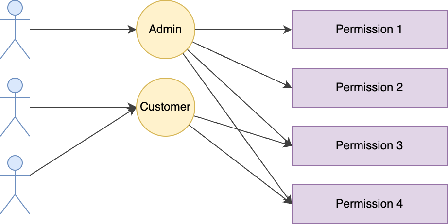

authorization is determining the access rights or privileges that user has to given resources.

#  Types

##  ACLs

| user | resource | permission |
|-|-|-|
| Alice | File 1 | read |
| Alice | File 1 | write |
| Bob | File 1 | read |
| Bob | File 2 | read |

ACLs (Access Control Lists) store the access of each user or group per object. 
This means that lookup is super fast because, assuming I’ve set up my indexes correctly, I can look up by objectId and userId to get a near instantaneous response. 

There are two major problems with ACLs — one is that if you have a lot of users, a lot of objects and a lot of permission types, you quickly end up needing to store a very large amount of data.
The most common use-case for ACLs are file-systems where typically there are at most a few users with access, meaning this wouldn’t be a problem.
The other major problem with ACLs is that if you update one thing — say Organization B didn’t pay and we want to disable their account, we suddenly need to figure out all of the objects that might be affected by that change and update the stored permissions for each of those objects.

This means that for a single action, we could end up modifying thousands, if not millions of records. 
This is both slow and error prone. If it’s too slow, we also end up with a security vulnerability where there is a window of time between when the user thought access was revoked and when it’s actually gone.

## RBAC

RBAC (Role-based Access Control) is one of the most common access control frameworks. 
In RBAC, you create roles, assigning users to those roles and associating those roles to sets of
permissions.  For example, 
- I might have a manager role that has access to particular things that a manager should be able to do. 
- I might also have an engineer role that has access to everything an engineer should be able to do. 
- I can add people to one or both of these roles. If they’re added to both, they get the intersection of permissions allowed to either. 

This allows you to update the permissions for everyone with a particular role very quickly. Likewise, it allows you to remove or add all needed permissions to a user very quickly — when someone is promoted to manager, I just add that role to them and they immediately have access to all of the things they should. 

One of the big problems with RBAC comes if you try to model something like ACLs as a 
user-facing feature on top. If you have something like this, you could quickly end up with the 
case that it’s no longer if I have permission to edit everything, but if I can edit things on one particular item and because the user can pick and chose which items I can edit, suddenly it 
could be the case that to represent exactly what I can do, I’ll need very specific roles that allow access to item3 and item6 but nothing else and I easily end up with a huge explosion of roles. 
RBAC often works very well for systems and infrastructure level authorization and it can work well for much more simple authorization schemes at the framework level. However, it isn't flexible enough for more complex scenarios. 

As a side note here, if you can make it fit your needs and don’t anticipate any future use-cases where it will be problematic, I would highly recommend using RBAC.

## ReBAC
ReBAC (Relation-Based Access Control) revolves around granting access based on the relationships between entities, such as users and resources. These relationships can be direct, like a customer representative accessing a customer’s record, or indirect like a teller accessing a customer’s record only if they belong to the same branch. The key objective is to ensure access is granted based on the contextual relationships between the requesting party and the requested resource.

While the concept may seem straightforward, ReBAC implementations can vary. Some advocate for a graph-based authorization model, which visually represents the interconnected relationships. Others prefer a policy-driven approach, where access control rules are defined through policies. Regardless of the chosen method, the ultimate goal remains the same: delivering context-based access decisions in real-time at runtime, adhering to the principle of least privilege (PoLP).

## ABAC
**Attribute Based Access Control or ABAC** is the most flexible of these options. Unlike ACLs or RBAC, ABAC doesn’t store permissions, but instead **calculates those permissions on demand** based on a number of attributes. These attributes can be anything and can either be passed in with the request or looked up on the fly. 

The most common implementation of ABAC follows the 
**XACML** standard. With this, attributes are categorized in one of three ways
- Subject (data  related to the user)
- Resource (data related to the object we’re trying to access)
- Environment (literally anything else — it could be if we’re getting too many requests or if the temperature is too hot outside right now). 

ABAC’s two biggest strengths are its flexibility and the fact that if I update a policy, that change will take place immediately since no cascading needs  to happen to get it applied to previously stored permissions. 

It has two primary downsides —  because permissions are calculated
dynamically, this takes time on each request (usually small, but non-zero). Additionally, 
if attributes are needed to make a decision and any of those downstream services I use to fetch
my attributes are unavailable, the permissions decision can’t be made. 

# Resources
- [ABAC, ReBAC, Zanzibar, ALFA... How and why should i implement authorization in my APIs](https://www.youtube.com/watch?v=byI_Jjb0c6c&list=LL&index=1)
- [How Authorization Evolves: From basic roles to ABAC](https://www.youtube.com/watch?v=1ZINsQN7gtM&list=LL&index=2)
- [Demystifying relationship-based access control (ReBAC)](https://axiomatics.com/blog/demystifying-relationship-based-access-control-rebac-what-you-need-to-know)
- [All Things Authorization](https://scribe.rip/all-things-authorization-d1713ad6b9e0)
- [ALFA](https://alfa.guide//)
- [CEDAR](https://www.cedarpolicy.com/en)
- [OpenFGA](https://openfga.dev/)
- [okta](https://www.okta.com)
