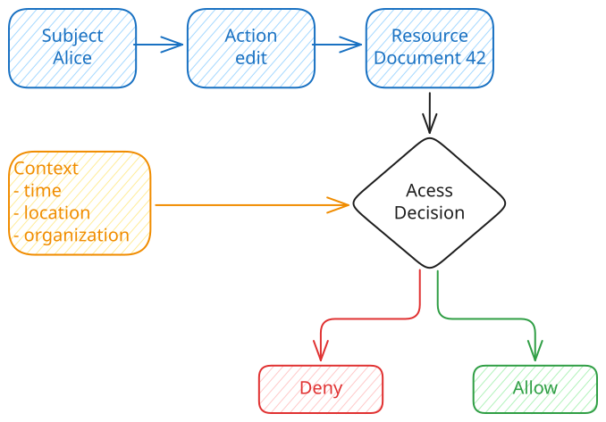
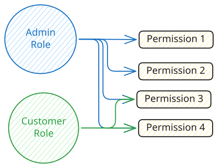

Authorization is determining the access rights or privileges that a user has to
given resources. It answers a question like:

> Can Alice edit Document 42?

This question has a **subject** (Alice), an **action** (edit) and a **resource**
(Document 42). Sometimes the decision also depends on the **context**, such as
the time, location or organization.

Authorization is different from authentication. Authentication determines who
the user is, while authorization determines what that user is allowed to do.

There are multiple ways to represent and evaluate access. The most common ones
are ACLs, RBAC, ReBAC and ABAC. Each one answers the same authorization question
using different information.

# Types

## ACLs

Table: An access control list, one row per user–resource–permission grant.

| user | resource | permission |
|-|-|-|
| Alice | File 1 | read |
| Alice | File 1 | write |
| Bob | File 1 | read |
| Bob | File 2 | read |

ACLs (Access Control Lists) store which users or groups have access to each
resource. To decide whether Alice can edit Document 42, the system looks for a
permission that directly connects Alice to that document.

This can make the decision simple and fast, especially when the data is indexed
by the resource and the user. ACLs are commonly used in file systems and
document sharing, where a resource often has a limited number of users with
access.

The first problem with ACLs is their size. If you have a lot of users, a lot of
resources and a lot of permission types, you can quickly end up storing a very
large amount of data.

The other problem appears when access depends on something bigger than a single
user or resource. Say Organization B did not pay and we want to disable its
account. We may need to find every resource affected by that change and update
the stored permissions for each one.

For a single action, we could end up modifying thousands, if not millions, of
records. This can be slow and error prone. It can also create a security problem
if there is a window between when access should be revoked and when all stored
permissions are actually updated.

ACLs work well when direct, resource-level sharing is the main requirement, but
become harder to manage when permissions need to follow organizational rules.

## RBAC

RBAC (Role-Based Access Control) is one of the most common access control
models. In RBAC, you create roles, assign users to those roles and associate the
roles with sets of permissions.

For example:

- A manager role can have access to actions that a manager should be able to do.
- An engineer role can have access to actions that an engineer should be able to do.
- A user can be assigned to one or both roles.

When a user has multiple roles, they normally get the **union** of the
permissions granted by those roles. This means that a user who is both a manager
and an engineer receives the permissions from both roles.

RBAC makes it easy to update permissions for everyone with a particular role.
When someone is promoted to manager, I can assign the manager role and they
immediately receive its permissions. When the responsibilities of all managers
change, I can update the role instead of updating every user.

One of the big problems with RBAC is **role explosion**. Imagine users can share
individual documents with each other. If I try to represent every possible
combination using roles, I may need a role for people who can edit Document 3
and Document 6, another role for Document 2 and Document 4, and so on. The
number of roles can quickly become difficult to manage.

RBAC often works well for organizational, system and infrastructure-level
authorization. It can also work well for applications with simple permission
schemes. It becomes less flexible when access depends on a particular resource
or on the relationship between users and resources.

As a side note, if RBAC fits the requirements and you do not anticipate use
cases where it becomes problematic, it is usually a good place to start.

## ReBAC

ReBAC (Relationship-Based Access Control) grants access based on relationships
between entities such as users, teams, organizations and resources.

A relationship can be direct:

> Alice is the owner of Document 42.

It can also be indirect:

> Alice is a member of Team A, and Team A owns Document 42.

In both cases, the system decides whether Alice can access the document by
following a path of relationships. This makes ReBAC useful for applications
with sharing, ownership, groups or hierarchies. Examples include collaboration
tools, social networks and systems where resources belong to teams or
organizations.

ReBAC can express resource-level permissions without creating a role for every
possible combination. It is also a natural fit when the domain is already
described using relationships.

The added flexibility comes with complexity. The system needs to store and
evaluate relationships, including indirect ones. As the graph grows, it can
become harder to understand why access was granted and to evaluate decisions
efficiently.

ReBAC implementations can vary. Some use a graph-based authorization model,[^zanzibar]
while others express relationships through policies. The goal is the same: make
access decisions using the relationship between the subject and the resource.

## ABAC

ABAC (Attribute-Based Access Control) calculates an access decision using
attributes and policies. Unlike a direct ACL entry or a role assignment, the
decision can depend on information about several parts of the request:

- **Subject attributes:** the user's department, job level or organization.
- **Resource attributes:** the document's owner, classification or organization.
- **Action attributes:** the operation being attempted, such as read or edit.
- **Environment attributes:** the time, location or any other request context.

For example, a policy could allow Alice to edit Document 42 only when Alice and
the document belong to the same organization and the document is not locked.

The most common standard associated with ABAC is **XACML**,[^xacml] which describes how
attribute-based policies and authorization decisions can be represented.

ABAC's biggest strength is its flexibility. A policy can combine multiple
conditions, and a policy update can affect future decisions immediately without
updating a permission on every resource.

It has two primary downsides. First, evaluating policies dynamically adds work
to every request. Second, the required attributes need to be available and
correct. If the system cannot retrieve an attribute needed by a policy, it may
not be able to make the decision safely. As policies grow, they can also become
difficult to understand, test and audit.

# Combining Access Control Models

These models are not mutually exclusive. A real system can use RBAC for broad
permissions, ReBAC for resource ownership and ABAC for contextual restrictions.

For example, editing a document might require all of the following:

- The user has an editor role (RBAC).
- The user belongs to the team that owns the document (ReBAC).
- The document is not locked (ABAC).

An ACL could still be used to share a particular document directly with another
user. Combining models is useful, but every additional model also makes the
authorization system harder to reason about.

<!-- DRAWING: Compare how the same question, "Can Alice edit Document 42?", is
answered by each model: ACL uses a direct grant, RBAC follows Alice -> Editor
role -> edit permission, ReBAC follows Alice -> Team -> Document, and ABAC
evaluates user/resource/action/context attributes. -->

# Comparison

Table: The four authorization models side by side — what each decision rests on, where it fits, and its main difficulty.

| Model | Decision is based on | Works well for | Main difficulty |
| --- | --- | --- | --- |
| ACL | Direct user or group permissions on a resource | File systems and resource sharing | Large numbers of stored permissions |
| RBAC | Permissions assigned through roles | Organizational and system-level access | Role explosion |
| ReBAC | Relationships between entities | Ownership, sharing, groups and hierarchies | Evaluating and understanding relationship paths |
| ABAC | Attributes evaluated against policies | Contextual and fine-grained rules | Policy and attribute complexity |

There is no access control model that fits every system. ACLs are simple for
direct sharing, RBAC is effective for stable organizational roles, ReBAC fits
domains built around relationships, and ABAC provides the most flexibility for
contextual rules.

The best option is usually the simplest model, or combination of models, that
can express the requirements clearly. More flexibility is useful, but it also
creates more policies, data and decisions that need to be understood and
maintained.

[^zanzibar]: The best-known example is Google's *Zanzibar* (2019), a globally
    distributed authorization system that stores relationships as tuples and
    answers access checks by walking them. It inspired open-source systems such
    as SpiceDB and OpenFGA.

[^xacml]: XACML — the eXtensible Access Control Markup Language — is an OASIS
    standard that defines an XML-based policy language and a request/response
    format for attribute-based authorization decisions.